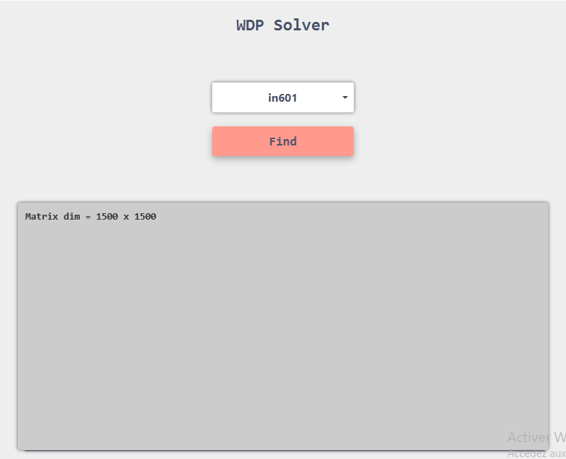

# WDP-Solver

This is a java implementation of the "Solving the winner determination problem via a weighted maximum clique heuristic" article by Qinghua Wu and Jin-Kao Hao for a study project

## Libraries :

* [jfoenix](http://jfoenix.com/)

## IDE: 

* [NetBeans](https://netbeans.org/)

### GUI

User just need to select one of the instances provided in the combo box and click on "Find" button to start the search.

### [Link to the scientific paper](http://www.info.univ-angers.fr/pub/hao/papers/WuHaoESWA2014.pdf)

### [Project Presentation](https://www.canva.com/design/DAEH46-BdME/8nZfkeDMHXinjd-zzRjI7w/view?utm_content=DAEH46-BdME&utm_campaign=designshare&utm_medium=link&utm_source=publishsharelink)

